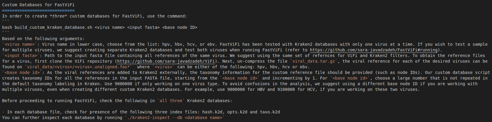

# Medical_Genomics_Project4

Welcome to our github repository for Project4 of the medical genomics course at INSA Lyon!

Before using our code, make sure you have nextflow installed on your computer, then please download :
 
- Kraken datasets for HPV on https://drive.google.com/file/d/1QYn5lDWjvhtIWCrwmzDc_1fy8ANrXWz1/view?usp=sharing

- the viral references from the ViFi repository on https://github.com/sara-javadzadeh/ViFi

- the software FastVifi on https://github.com/sara-javadzadeh/FastViFi.git

- the human reference on https://drive.google.com/file/d/1XBZbwgcV1n2AWWAyt2RWfSKKxzssRFBo/view?usp=share_link

Save them all where you clone this github directory.

Then open your terminal, go to your github directory and do 
``docker pull sarajava/fastvifi``


You can run the code now writing:
``nextflow run pipeline_V2.nf``


## How to build your own kraken dataset for FastViFi for other viruses ?

First, clone the repository on the following link:
https://github.com/sara-javadzadeh/kraken2

Then, install kraken2 in the same directory by running :
``./install_kraken2.sh .``

After the installation is completed, you have to follow what is written in the Manual, we have copied and pasted what you should do:

<div align="center">
 
 </div>
 
Here is the command : 
```
bash build_custom_kraken_database.sh <virus name> <input fasta> <base node ID>
```


### Example

Let's say we want to create a kraken database for ebv virus, basically what you have to write in your terminal is 
```
bash build_custom_kraken_database.sh ebv ../ViFi/viral_data/ebv/ebv.unaligned.fasta 9000000
```

After waiting for years, 3 directories are created:
- Kraken2StandardDB_k_25_ebv_hg
- Kraken2StandardDB_k_22_ebv
- Kraken2StandardDB_k_18_ebv

Check if the files hash.k2d, opts.k2d and taxo.k2d are present for each.
If not, extract the files of the taxdump.tar.gz in the "taxonomy" directory for each and re-run the command.
You can check the log file to see if databases are complete.

Move the 3 directories to the directory "kraken_datasets"

Enjoy!
